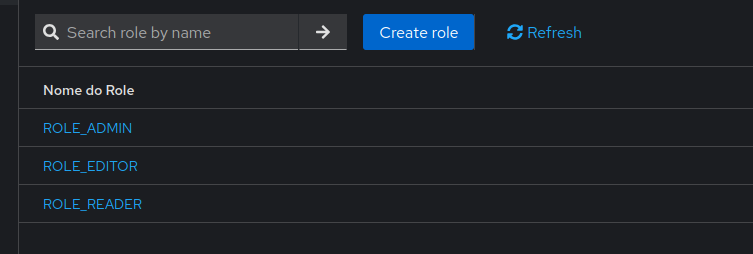
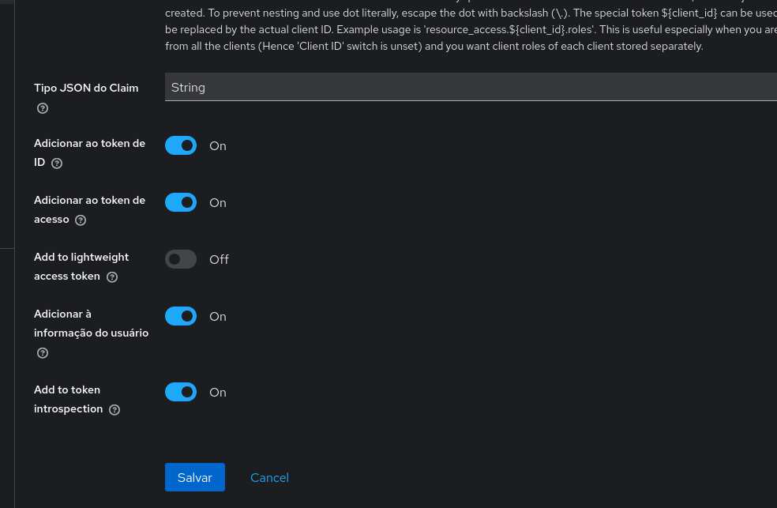
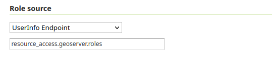
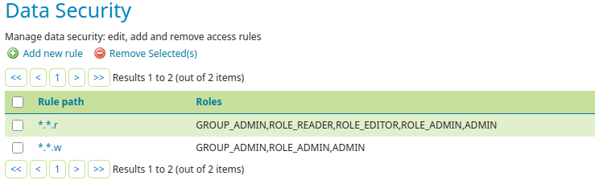

## Keycloak in Geoserver

### 1 - Create a client in Keycloak with custom settings [Keycloak for Geoserver](https://docs.geoserver.org/main/en/user/community/keycloak/authentication.html);

### 2 - Run geoserver in Docker:

```bash
docker compose up -d
```

```bash
docker ps -a
```

#### Insert container id in environment variables:

```bash
source .env
```

#### Obs.: If you are using docker make sure that the Keycloak Auth address are visible inside container;

```yml
    network_mode: host
```

### 3 - Download and install the geoserver in `localhost` using [https://docs.geoserver.org/main/en/user/installation/linux.html](https://docs.geoserver.org/main/en/user/installation/linux.html):

```bash
sudo unzip geoserver-2.26.2-bin.zip -d /usr/share/geoserver
```

#### Make yourself the owner of the geoserver folder:

```bash
sudo chown -R ${USER} /usr/share/geoserver/
```

#### Start GeoServer by changing into the directory `geoserver/bin` and executing the startup.sh script:

```bash
GEOSERVER_HOME=/usr/share/geoserver/ sh /usr/share/geoserver/bin/startup.sh
```

#### **Obs.:** Set the geoserver home with `GEOSERVER_HOME=/usr/share/geoserver/` before the command.

#### **Obs.:** Install Java if requested:

```bash
sudo apt-get install openjdk-17-jre-headless/noble-updates
```

#### **Obs.:** Change the port before `startup` with `nano /usr/share/geoserver/start.ini`:

```txt
    ## Connector host/address to bind to
    # jetty.http.host=0.0.0.0

    ## Connector port to listen on
    jetty.http.port=8080 <<<<====
```

#### **Obs.:** Check the available ports:

```bash
ss -tulpn
```

#### To rebuild geoserver:

```bash
sudo rm -R /usr/share/geoserver
```

```bash
sudo unzip geoserver-2.26.2-bin.zip -d /usr/share/geoserver
```

```bash
sudo chown -R ${USER} /usr/share/geoserver/
```

### 4 - Download the Auth Extensions for Geoserver, but first identify Geoserver version [https://geoserver.org/download/](https://geoserver.org/download/):

#### **Obs.:** You can download extensions in [https://geoserver.org/release/2.26.2/](https://geoserver.org/release/2.26.2/) or [https://build.geoserver.org/geoserver/main/community-latest/](https://build.geoserver.org/geoserver/main/community-latest/) using  2.26.1 as example, or findin the selected extension in `Security >>> Key authentication`;

#### A. Download AuthKey Plugin [https://build.geoserver.org/geoserver/2.26.x/ext-latest/geoserver-2.26-SNAPSHOT-authkey-plugin.zip](https://build.geoserver.org/geoserver/2.26.x/ext-latest/geoserver-2.26-SNAPSHOT-authkey-plugin.zip).

```bash
wget https://build.geoserver.org/geoserver/2.26.x/ext-latest/geoserver-2.26-SNAPSHOT-authkey-plugin.zip
```

#### B. Download Keycloak Authentication [https://build.geoserver.org/geoserver/2.26.x/community-latest/geoserver-2.26-SNAPSHOT-sec-keycloak-plugin.zip](https://build.geoserver.org/geoserver/2.26.x/community-latest/geoserver-2.26-SNAPSHOT-sec-keycloak-plugin.zip);

```bash
wget https://build.geoserver.org/geoserver/2.26.x/community-latest/geoserver-2.26-SNAPSHOT-sec-keycloak-plugin.zip
```

#### C. Download OAuth2 Plugin [https://build.geoserver.org/geoserver/2.26.x/community-latest/geoserver-2.26-SNAPSHOT-sec-oauth2-openid-connect-plugin.zip](https://build.geoserver.org/geoserver/2.19.x/community-latest/geoserver-2.26-SNAPSHOT-sec-oauth2-openid-connect-plugin.zip).

```bash
wget https://build.geoserver.org/geoserver/2.26.x/community-latest/geoserver-2.26-SNAPSHOT-sec-oauth2-openid-connect-plugin.zip
```

### 5 - Unzip the files and move to `/WEB-INF/lib` in geoserver config files:

#### A. If you are using docker:

```bash
unzip geoserver-2.26-SNAPSHOT-authkey-plugin.zip -d geoserver-2.26-SNAPSHOT-authkey-plugin/
```

```bash
docker cp geoserver-2.26-SNAPSHOT-authkey-plugin/. ${CONTAINER_ID}:/usr/local/tomcat/webapps/geoserver/WEB-INF/lib/
```

```bash
unzip geoserver-2.26-SNAPSHOT-sec-keycloak-plugin.zip -d geoserver-2.26-SNAPSHOT-sec-keycloak-plugin/
```

```bash
docker cp geoserver-2.26-SNAPSHOT-sec-keycloak-plugin/. ${CONTAINER_ID}:/usr/local/tomcat/webapps/geoserver/WEB-INF/lib/
```

```bash
unzip geoserver-2.26-SNAPSHOT-sec-oauth2-openid-connect-plugin.zip -d geoserver-2.26-SNAPSHOT-sec-oauth2-openid-connect-plugin/
```

```bash
docker cp geoserver-2.26-SNAPSHOT-sec-oauth2-openid-connect-plugin/. ${CONTAINER_ID}:/usr/local/tomcat/webapps/geoserver/WEB-INF/lib/
```

#### Restart the docker container or use `systemctl` comand to restart geoserver service and load extensions and plugins for geoserver:

```bash
docker compose restart
```

#### To view the installed files in geoserver:

```bash
docker exec -it geoserver-local bash
```

#### B. If you are using Geoserver local unzip the files in `/usr/share/geoserver/webapps/geoserver/WEB-INF/lib`:

```bash
unzip geoserver-2.26-SNAPSHOT-authkey-plugin.zip -d /usr/share/geoserver/webapps/geoserver/WEB-INF/lib
```

```bash
unzip geoserver-2.26-SNAPSHOT-sec-keycloak-plugin.zip -d  /usr/share/geoserver/webapps/geoserver/WEB-INF/lib
```

```bash
unzip geoserver-2.26-SNAPSHOT-sec-oauth2-openid-connect-plugin.zip -d /usr/share/geoserver/webapps/geoserver/WEB-INF/lib
```

### 6 - Go to the `Authentication Filters` and create a new `New Authentication Filter` in authentication in geoserver security section.

> **_NOTE:_**  Some import notes:
>
> Get `well-known` config for Keycloak in [https://localhost/iam/realms/TerraCollect-dev-env/.well-known/openid-configuration](https://localhost/iam/realms/TerraCollect-dev-env/.well-known/openid-configuration). You may have a similar response like [./openid-configuration](./well-known.openid-configuration.json);
>
> Get the `Keycloak Adapter Config` in the client section in keycloak admin console option `Action >>> Download Adapter Config`, but the usage of Keycloak adapters is deprecated since 2023.
>
> You must add this `Authentication Filter` to high position in `web` option at `Filter Chain`.

### 7 - Roles Mangement when using `OAuth2 Openid Authentication` in geoserver:

#### A - Add the following roles to client for geoserver in Keycloak, the roles must be `ROLE_{}` format:



#### B - Now, set the client scopes in the geoserver client in `geoserver-client >> Client Scopes >> geoserver-client-dedicated`, click in `Add Mapper >> From predefined mappers` and click on client roles. After, you must to click client roles and enable `User Info` and `Access Token`:



#### This configuration make the roles visible when user authenticates.

#### C - Set the `Role Source` in `Authentication Filter` in geoserver, you must tell where find the roles, this example shows using cliente roles, you must select `UserInfo Endpoint` and provide the location in JSON where the roles are located.

#### You can view this generated information in `Client Scopes >> Evaluate`, search a user and check if the `Generated user info` option is showing the repective roles, like example below:

```json
{
    "resource_access": {
        "geoserver": {
            "roles": [
                "ROLE_ADMIN"
            ]
        }
    },
}
```

#### This location for the example is `resource_access.geoserver.roles`.



#### D - Now in geoserver add the same role names in `Security >> Users, Groups, and Roles >> Roles`.


#### E - Now set the rules for roles in `Security >> Data` using the option `Add new rule` or update a saved rule:


